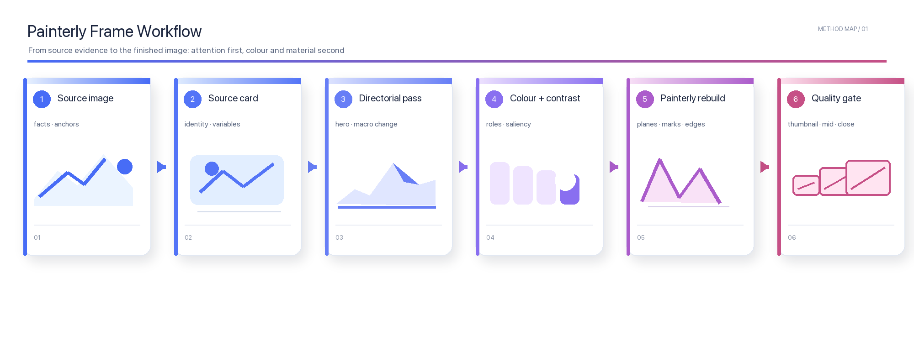

# Painterly Frame

`Painterly Frame` 是一个把照片或文字场景转译成原创绘画动画画面的通用 skill。它先锁定初始版本最重要的构图、曝光与色彩作者性，并默认继承输入照片的原始像素比例，再用连续、互相连接的笔触和材质差异完成画面，避免弱模型把结果做成色块拼贴或全局滤镜。

> [!TIP]
> **模型建议：** 如果运行环境支持选择模型，优先使用 `gpt-5.6 Luna-极高`。模型的性能会直接影响画面的生成效果和细节表现，包括构图执行、笔触连续性、材质、人物五官与空间层次；更弱或不同的模型可能产生明显不同的结果。

> [!IMPORTANT]
> **仅限个人、非商业使用。** 不允许销售、收费生成、订阅服务、代做、咨询、培训、SaaS/API、公司或客户项目及其他商业化用途。任何商业使用均须事先获得 zcjun（GitHub：[@zcjunn](https://github.com/zcjunn)）的明确书面许可。详见 [个人非商业许可证](LICENSE)。
>
> **Personal, non-commercial use only.** Selling, paid generation, subscriptions, commissions, consulting, training, SaaS/API use, organizational or client work, and all other commercial uses require prior explicit written permission from zcjun. See [LICENSE](LICENSE).


## 它解决什么问题

- 把人物、风景、建筑、海浪、森林、雪原等输入转成有导演判断的绘画动画画面。
- 默认保留已经有效的主体尺度、头顶空间、地平线、安静区和色彩面积；只有用户明确要求或确有构图问题时，才放大主体、压缩环境、重组负空间或重做色域。
- 让色彩由场景负责：根据原图与叙事选择主色场、结构色、焦点色、过渡中性色和可选的色彩碰撞，而不是机械套用固定冷暖或固定暗调。
- 把对比度分配给焦点、支撑结构和背景场：非视觉主体可以降微对比和边缘密度，但仍保持有色的空间层次。
- 让跨模型的一致性体现在构图锁、色彩锁、共享光场和材质笔触合同上，而不是要求相同像素或相同随机笔触。
- 当画面有人物时，额外锁定头部轴线、眼线、视线、表情和五官相对间距，避免斜眼、上下眼位漂移、眼间距过宽或五官贴纸化；五官细节服从透视和共同光场，而不是套用通用动漫脸。

## 适合使用的场景

- “把这张照片变成有导演式主体重构的绘画动画关键帧。”
- “保留人物和山的位置，但放大山体、降低背景细节，让主体更有压迫感。”
- “把海浪抽象成几块有方向的青绿色形体，保留原来的俯拍关系。”
- “把雪景做成高调、粉蓝和暖光的画面，不要强行压成夜景。”
- “分析这张图的视觉主体和颜色关系，只输出可执行的生成提示词。”

不适合用于：忠实修图、逐像素复原、严格的纪录片拓扑保持，或复制任何已知作品的角色、标志、台词、道具、场景设计和准确镜头。

## English Introduction

`Painterly Frame` is a source-aware image transformation skill. It first locks composition, exposure and scene-owned colour, inherits the supplied photo's exact pixel aspect ratio by default, then turns the locked design into an original painterly animated frame with connected brush fields and material-specific marks instead of applying a generic filter.

> [!TIP]
> **Model recommendation:** When model selection is available, prefer `gpt-5.6 Luna-极高`. Model capability directly affects the generated image's overall quality and fine detail, including composition execution, brush continuity, materials, facial geometry and depth; weaker or different models may produce visibly different results.



### What it does

- Preserves declared recognition anchors and already-effective source distribution by default; opens controlled changes to scale, negative space, light shape and repeated detail only when permitted.
- Assigns colour by scene function: dominant field, structural counter, focal accent, neutral bridge and optional colour collision.
- Gives the focal event the strongest useful contrast while lowering background microcontrast, edge density and texture frequency.
- Builds large shapes first, then adds faceted planes, material-specific brush marks and restrained graphic interventions.
- When a human face is visible, adds a perspective-aware facial packet for head axis, eye-line, gaze, expression and feature spacing, with a close-scale anatomy gate.

### Use it when

- You want a source-aware painterly animated image rather than a photographic filter.
- You want stronger abstraction without losing the main subject, landmark or spatial relationship.
- You need an explicit colour and contrast plan, including high-key, mid-key or low-key results.

Do not use it to copy a named work, character, logo, exact frame or protected production design.

## 使用方法

### 1. 直接描述目标

上传图片，然后用自然语言提出目标即可。skill 会自动选择“新建画面”“编辑目标”“只分析”或“只写提示词”的路径。

推荐至少说明四件事：

1. **必须保留的锚点**：人物身份、人数、动作、山峰位置、地平线、建筑关系、文字等；未另行指定时，输出画面比例继承输入照片的原始像素比例。
2. **允许改变的范围**：仅用户授权的主体放大、前景遮挡、负空间重组、重复元素合并、光形重构或色彩重脚本；未授权的 Edit Target 默认保留原分布。
3. **第一视觉读取**：观众最先看到什么，或希望画面产生什么压力与方向。
4. **色彩倾向**：保留原色、重新平衡、或完全重写；是否允许色彩碰撞。冷暖对比不是必选项。

### 2. 显式调用

也可以直接写：

```text
$painterly-frame
```

然后补充输入图、保留锚点、抽象程度和输出要求。

### 3. 可复制的请求模板

```text
使用 $painterly-frame。
把这张图转成一张原创绘画动画关键帧，输出一张无边框成片。

必须保留：{人物/主体/地标/位置/动作/比例}
构图策略：{保留并丰富 / 明确重构；说明裁切、头顶空间、主体尺度、地平线和安静区}
色彩策略：{保留并整理 / 重新平衡 / 重新脚本；主色场、结构色、焦点色、中性桥接；主对比轴}
允许改变：{仅用户授权的主体尺度、前景遮挡、负空间、重复细节、光形、色彩区域}
第一读取：{观众先看到的主体或关系}
抽象程度：{克制 / 明显 / 强烈}
曝光：{高调 / 中调 / 低调}
避免：{新增人物、文字、标志、复制其他作品的具体设计}
```

## 技能内部的工作顺序

1. **建立 Source Card**：区分观察到的事实与推断，标出识别锚点、可变区域、主体和层次。
2. **先锁构图与色彩**：决定保留并丰富还是明确重构；记录比例、裁切、主体尺度、头顶空间、地平线、安静区、曝光键、三大值组、色彩角色和主对比轴。
3. **只在允许时写导演提案**：Directed-restage 才要求一个主宏观变化和一个辅助变化；Preserve-and-enrich 通过光形、色彩邻接、边缘节奏和观看路径丰富原构图。
4. **建立连续绘画合同**：先做五到九个互相咬合的大色面，再用内部色彩转折、邻接连接、共享光场和结构/转折/焦点三级笔触完成材质。
5. **分配对比度和材质**：焦点拥有最有用的两到三个对比维度；支撑结构保留中等信息；背景降低局部值差、微对比、硬边和纹理频率，但仍保持有色空间层次。
6. **多尺度质检**：在缩略图、中景和近景分别检查锁定的构图/色彩、主体读取、连续光场、材质分化和无意新增元素。

人物存在时，近景检查还必须确认：两眼沿同一头部轴线和视线方向组织，眼间距与脸部透视相称，鼻梁—嘴—下巴不偏离面部中轴，表情没有被泛化；只有姿势、透视或明确表情造成的非对称才允许保留。一次定向修正仍失败时，应报告该模型的五官几何超出支持范围，而不是继续叠加风格形容词。

## 不同模型如何保持一致

这里的“一致”指视觉系统和导演判断一致，而不是像素、随机种子或每一笔的位置相同。不同模型必须共享同一份 Portable Render Contract：

完整执行规范见 [Model Consistency Contract](references/model-consistency.md)。

- 相同的主体、数量、动作、空间拓扑和受保护颜色；
- 相同的构图锁：比例、裁切/头顶空间、主体尺度、安静区、地平线、观看路径和允许的重构范围；
- 相同的五到九个大色面及其面积、轮廓、遮挡和负空间关系；
- 相同的曝光键、三组明度，以及主色场、结构色、焦点色和中性桥接色的空间归属；
- 相同的焦点、支撑和背景对比度预算；
- 相同的主体轮廓重建与四到七个关键分面要求；
- 不同材质各自明确的笔触尺度、方向、边缘和反光方式；
- 相同的“非滤镜化”验收：缩略图必须看到大形变化，近景必须看到材质差异，不能只是原照片叠加油画纹理或统一调色。

允许变化的是具体笔触落点、次要纹理、小型自然细节和不改变色彩职责的细微色相偏移。如果某个模型改变第一视觉读取、破坏识别锚点、交换色彩角色、让背景与主体同样抢眼，或让皮肤、布料、金属、草木共享同一种笔触，它就不属于一致结果。随机种子不能跨模型保证一致；需要像素完全相同的区域应使用确定性合成，而不是生成式重绘。

## Cross-model Consistency

Consistency means a shared visual and directorial contract, not identical pixels, seeds or brush placement. Every model is evaluated against the same anchors and topology, five-to-nine macro masses, three value groups, spatial colour roles, contrast tiers, focal plane map, material-specific mark grammar, edge hierarchy and anti-filter gate. Exact brush stamps, secondary texture and small hue shifts may vary only when their visual ownership remains unchanged. A model set is considered consistent only when every output passes the same thumbnail, mid-scale and close-scale checks; a strong average cannot hide one source-literal or globally filtered result.

See [Model Consistency Contract](references/model-consistency.md) for the full portable specification and acceptance boundary.

## 版权边界

这个 skill 只抽象通用的构图、色彩、光线、材质和绘画动画方法，生成原创画面。它不会也不应复制任何受保护作品的角色身份、标志、文字、独特道具、准确场景设计、镜头布局或逐帧画面。若用户提出一比一复刻，应改为描述可观察的视觉关系，并保留原创主体与世界观。

## 本地安装

将本目录放入 skills 目录即可：

```bash
git clone https://github.com/zcjunn/painterly-frame.git ~/.codex/skills/painterly-frame
```

安装后可用自然语言自动触发，或显式写 `$painterly-frame`。

## 项目结构 / Project Structure

```text
painterly-frame/
├── SKILL.md                  # 运行入口：触发范围、路由、主流程与验收契约
├── agents/openai.yaml        # UI 名称、简述和默认调用提示
├── references/               # 按任务条件读取的视觉系统与质量标准
│   ├── composition-color-lock.md # 初始版构图/色彩优先级合同
│   ├── painterly-continuity.md   # 跨模型连续笔触合同
│   └── facial-control.md          # 人物五官、视线和表情控制合同
├── assets/                   # README 使用的中英文流程图
├── evals/
│   ├── evals.json            # 效果与回归用例
│   └── trigger-evals.json    # should-trigger / should-not-trigger 用例
├── README.md                 # 面向使用者的双语介绍和安装说明
└── LICENSE                   # 自定义个人非商业许可证
```

该结构采用渐进式加载：执行时先根据 `name` 和 `description` 判断是否触发，再读取 `SKILL.md` 主流程，只有命中具体条件时才加载对应的 `references/`。`assets/` 不作为指令加载；两组 Eval 分别验证“能否正确触发”和“触发后是否真正改善结果”，避免把路由问题与执行质量混在一起。

The repository uses progressive disclosure: discovery metadata selects the skill, `SKILL.md` carries the shared execution path, and individual references are loaded only when their stated conditions apply. Trigger evaluation and effect evaluation are kept separate so routing accuracy is not confused with output quality.

## 许可证 / License

本项目采用自定义的 [Painterly Frame 个人非商业许可证](LICENSE)。它允许自然人为了个人学习、研究、试验或兴趣免费使用和修改，但不允许任何商业、组织或客户用途，也不允许将本项目或其生成服务用于收费。商业使用须事先获得 zcjun 的明确书面许可。

This project uses a custom [Painterly Frame Personal Non-Commercial License](LICENSE). It is not an open-source license: personal non-commercial use is permitted, while commercial, organizational, client, paid-generation, subscription, consulting, training, SaaS/API, and monetized-output uses require prior explicit written permission from zcjun.
